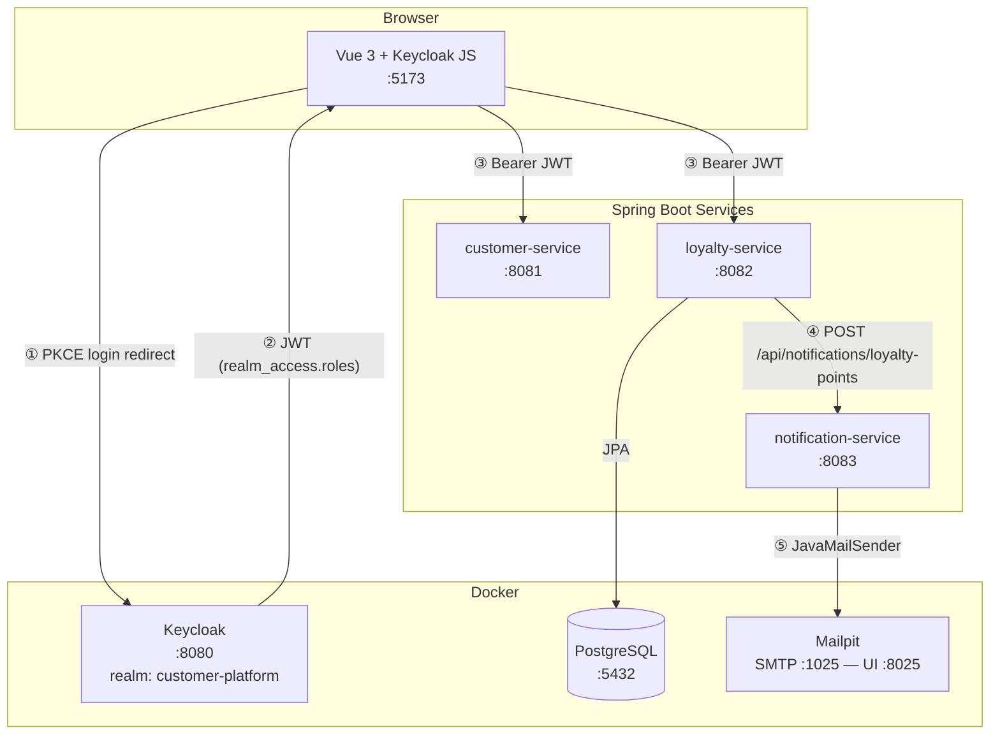
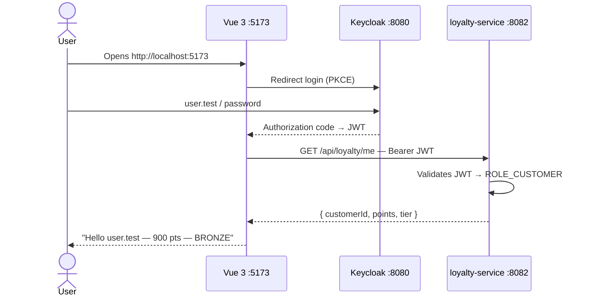
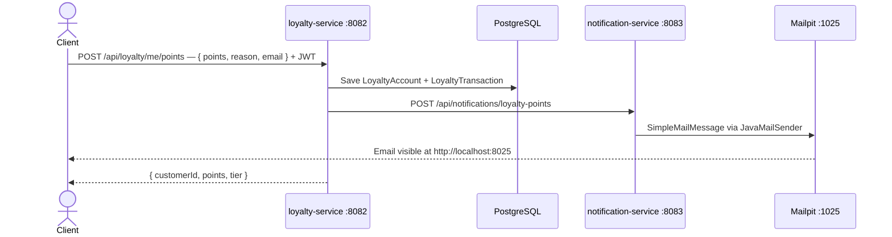

# customer-platform-poc

A microservices platform demonstrating OAuth2/JWT authentication, loyalty point management, and email notifications — built with Spring Boot 3, Vue 3, and Keycloak.

---

## Overview



---

## Services

| Service | Port | Stack | Auth | Storage |
|---|---|---|---|---|
| `customer-service` | 8081 | Spring MVC · OAuth2 Resource Server | JWT Keycloak | — |
| `loyalty-service` | 8082 | Spring MVC · JPA · Spring Batch | JWT Keycloak | PostgreSQL |
| `notification-service` | 8083 | WebFlux · Spring Integration · Mail | None (internal) | — |
| Keycloak | 8080 | Docker | — | — |
| PostgreSQL | 5432 | Docker | — | — |
| Mailpit | 1025 / 8025 | Docker | — | — |

---

## Repository Structure

```
customer-platform/
├── demo.sh                         # One-command local startup script
├── doc/
│   └── architecture.md             # Detailed architecture & sequence diagrams
├── frontend/                       # Vue 3 SPA (Vite + Keycloak-js)
├── infrastructure/
│   └── docker-compose.yml          # PostgreSQL · Keycloak · Mailpit · MongoDB
├── kubernetes/                     # K8s manifests (WIP)
└── services/
    ├── customer-service/           # User profile endpoints
    ├── loyalty-service/            # Points · tiers · Spring Batch recalculation
    └── notification-service/       # Email dispatch via Spring Integration
```

---

## Key Flows

### Login + loyalty display



### Add points + email notification



---

## Getting Started

### Prerequisites

| Tool | Version |
|---|---|
| Java | 21 |
| Maven | 3.9+ |
| Docker | 24+ |
| Node.js | 20+ |

### 1. Start infrastructure + services

```bash
./demo.sh
```

This script starts Docker (Keycloak, PostgreSQL, Mailpit), configures the Keycloak realm and test user, builds and launches all Spring Boot services.

### 2. Start the frontend

```bash
# Free the port if already in use, then start
lsof -ti:5173 | xargs kill 2>/dev/null; true
cd frontend && npm install && npm run dev
# → http://localhost:5173
```

### 3. Log in

| Field | Value |
|---|---|
| URL | http://localhost:5173 |
| Username | `user.test` |
| Password | `password` |

> These are **local development credentials only**.

### 4. View emails

Open **http://localhost:8025** (Mailpit) to see notifications triggered by point additions.

---

## API Endpoints

### customer-service `:8081`

| Method | Path | Auth |
|---|---|---|
| GET | `/api/public/ping` | None |
| GET | `/api/customers/me` | JWT |
| GET | `/api/admin/dashboard` | `ADMIN` |
| GET | `/actuator/health` | None |

### loyalty-service `:8082`

| Method | Path | Auth |
|---|---|---|
| GET | `/api/loyalty/me` | `CUSTOMER` / `ADMIN` |
| POST | `/api/loyalty/me/points` | `CUSTOMER` / `ADMIN` |
| POST | `/api/admin/batches/recalculate-tiers` | `ADMIN` |
| GET | `/actuator/health` | None |

### notification-service `:8083`

| Method | Path | Auth |
|---|---|---|
| POST | `/api/notifications/loyalty-points` | None (internal) |
| GET | `/actuator/health` | None |

---

## Test the full pipeline (curl)

```bash
# 1. Get a JWT
TOKEN=$(curl -s -X POST http://localhost:8080/realms/customer-platform/protocol/openid-connect/token \
  -H "Content-Type: application/x-www-form-urlencoded" \
  -d "client_id=customer-platform-frontend&username=user.test&password=password&grant_type=password" \
  | python3 -c "import sys,json; print(json.load(sys.stdin).get('access_token',''))")

# 2. Get loyalty account
curl -s -H "Authorization: Bearer $TOKEN" http://localhost:8082/api/loyalty/me

# 3. Add points (triggers email notification)
curl -s -X POST http://localhost:8082/api/loyalty/me/points \
  -H "Authorization: Bearer $TOKEN" \
  -H "Content-Type: application/json" \
  -d '{"points": 100, "reason": "Purchase", "email": "user.test@test.com"}'
```

---

## Security Notes

- All `/api/**` endpoints require a valid Keycloak JWT except `/api/public/**` and internal service-to-service calls
- JWT roles are extracted from `realm_access.roles` and mapped to Spring Security `ROLE_*` via `JwtAuthConverter`
- Credentials in this repo (`admin/admin`, `user.test/password`) are **for local development only** — never use them in production
- `notification-service` has no authentication as it is only reachable internally

---

## Further Reading

- [Architecture & sequence diagrams](doc/architecture.md)
- [loyalty-service README](services/loyalty-service/README.md)
- [notification-service README](services/notification-service/README.md)
- [frontend README](frontend/README.md)
