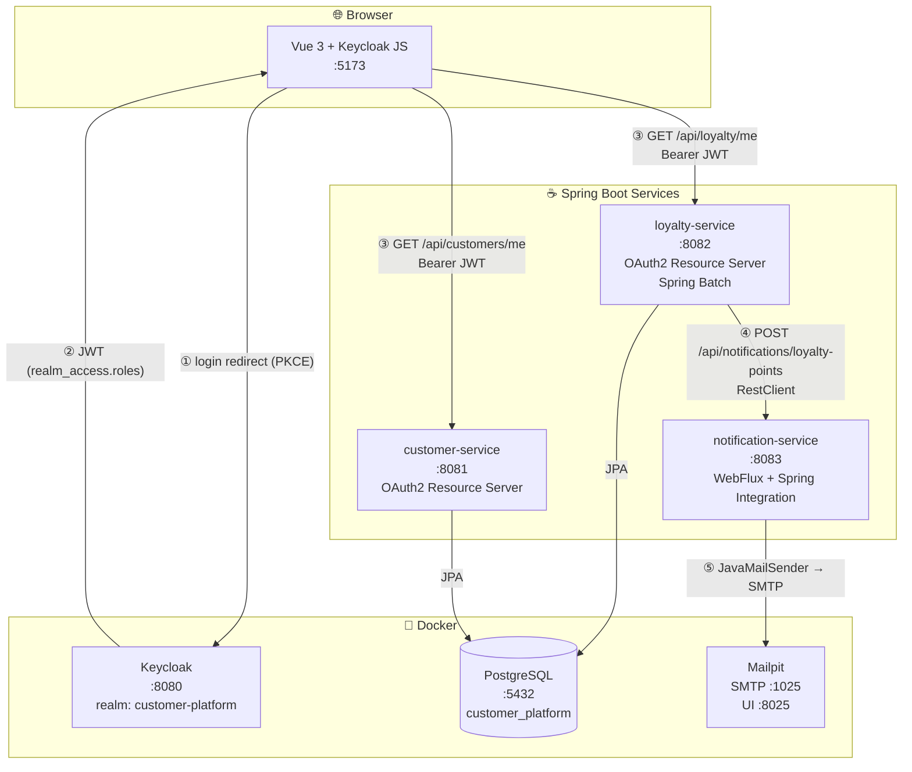
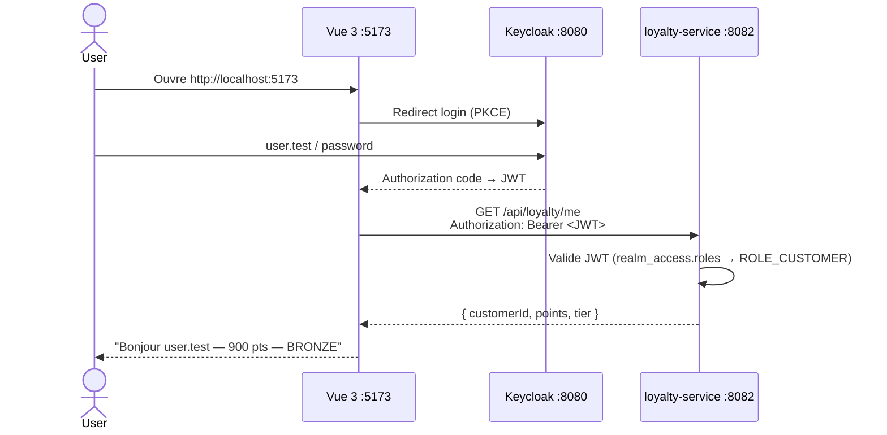
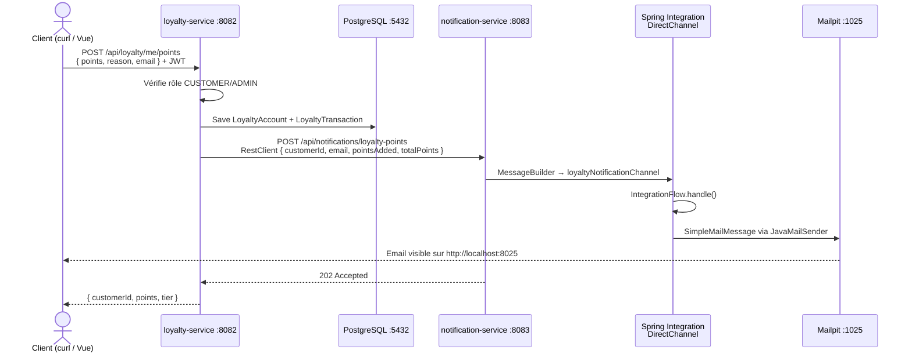
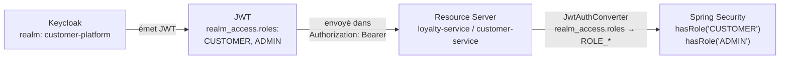

# customer-platform — Architecture

---

## Vue d'ensemble



---

## Flux 1 — Login + affichage points (démo frontend)



---

## Flux 2 — Ajout de points + notification email



---

## Sécurité JWT



---

## Structure des services

| Service | Port | Stack | Auth | Base |
|---------|------|-------|------|------|
| `customer-service` | 8081 | Spring MVC · OAuth2 | JWT Keycloak | — |
| `loyalty-service` | 8082 | Spring MVC · JPA · Batch | JWT Keycloak | PostgreSQL |
| `notification-service` | 8083 | WebFlux · Integration · Mail | Aucune (interne) | — |
| Keycloak | 8080 | Docker | — | — |
| PostgreSQL | 5432 | Docker | — | — |
| Mailpit | 1025/8025 | Docker | — | — |

---

## Lancer la démo

```bash
# Tout démarrer (infrastructure + services Java)
./demo.sh

# Frontend
cd frontend && npm run dev
# → http://localhost:5173

# Emails reçus
open http://localhost:8025
```

### Test pipeline complet (curl)

```bash
TOKEN=$(curl -s -X POST http://localhost:8080/realms/customer-platform/protocol/openid-connect/token \
  -H "Content-Type: application/x-www-form-urlencoded" \
  -d "client_id=customer-platform-frontend&username=user.test&password=password&grant_type=password" \
  | python3 -c "import sys,json; print(json.load(sys.stdin).get('access_token',''))") \
&& curl -s -X POST http://localhost:8082/api/loyalty/me/points \
  -H "Authorization: Bearer $TOKEN" \
  -H "Content-Type: application/json" \
  -d '{"points": 100, "reason": "Achat", "email": "user.test@test.com"}'
```
